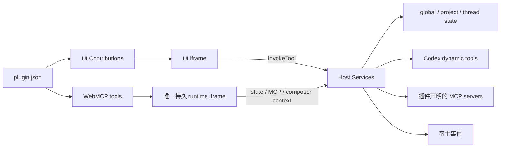

# Whale Buddy Plugin v2 开发规范与指引

本文是 Whale Buddy 插件协议 v2 的开发规范。适用于插件作者、商城维护者和宿主开发者。
协议实现以仓库中的 `src/shared/plugin.ts`、`src/main/plugin-host.ts` 与
`packages/plugin-sdk/` 为准。

## 1. 设计目标

Plugin v2 把插件能力拆成两个正交部分：

- **UI Contribution**：声明插件在 Whale 界面中的展示位置，只负责呈现与收集输入。
- **WebMCP**：声明可被 UI、浏览器模型上下文或 Codex 调用的工具，负责业务动作。

两者通过 Host Services 协作。插件 iframe 不直接访问 Electron、Node.js 或
`window.whale`。



核心原则：

1. Manifest 是声明，不承载运行时代码。
2. UI 是视图，不直接实现远程调用等业务逻辑；优先调用 WebMCP。
3. runtime 是执行层，一个启用插件只有一个持久 runtime iframe。
4. Host Services 是能力边界，统一处理生命周期、上下文、状态、权限、凭据、MCP、事件和
   Codex 工具桥接。
5. 所有插件输入、状态和工具结果必须是可 JSON 序列化的数据。

## 2. 插件目录

推荐目录结构：

```text
my-marketplace/
├── .agents/plugins/marketplace.json
└── plugins/
    └── my-plugin/
        ├── .codex-plugin/
        │   └── plugin.json
        ├── .mcp.json                 # 可选：MCP 服务声明
        ├── skills/                   # 可选：Codex Skills
        │   └── my-skill/SKILL.md
        ├── ui-src/                   # UI/runtime 源码
        │   ├── index.html
        │   └── src/main.tsx
        ├── ui/                       # 交付给 Whale 的静态产物
        │   ├── index.html
        │   └── assets/...
        └── vite.config.ts
```

`.codex-plugin/plugin.json` 是插件唯一入口。`whale.apiVersion` 必须严格为 `2`；Whale
不会读取 v1，也不会推断或兼容旧字段。

`entry` 必须：

- 以 `./` 开头；
- 指向插件根目录内已经存在的 `.html` 文件；
- 解析真实路径后仍位于插件根目录内；
- 使用相对资源路径。Vite 项目应设置 `base: './'`。

## 3. 完整 Manifest 示例

```json
{
  "name": "vendor-search",
  "version": "1.0.0",
  "description": "搜索当前账号可访问的业务数据。",
  "author": { "name": "Vendor" },
  "interface": {
    "displayName": "业务搜索",
    "shortDescription": "搜索业务数据",
    "developerName": "Vendor",
    "category": "Productivity"
  },
  "skills": "./skills/",
  "mcpServers": "./.mcp.json",
  "whale": {
    "apiVersion": 2,
    "uiContributions": [
      {
        "id": "search-page",
        "type": "page",
        "placement": "navigation",
        "entry": "./ui/index.html",
        "title": "业务搜索",
        "order": 100
      },
      {
        "id": "scope-selector",
        "type": "widget",
        "placement": "composer",
        "entry": "./ui/index.html",
        "order": 100
      },
      {
        "id": "search-command",
        "type": "action",
        "placement": "commandPalette",
        "entry": "./ui/index.html",
        "title": "打开业务搜索",
        "description": "从命令面板打开业务搜索。",
        "keywords": ["search", "搜索"],
        "order": 100
      },
      {
        "id": "search-result",
        "type": "card",
        "placement": "message",
        "entry": "./ui/index.html",
        "title": "业务搜索结果",
        "match": {
          "itemTypes": ["mcpToolCall"],
          "server": "vendor-service",
          "tools": ["search"]
        },
        "order": 100
      }
    ],
    "webMcp": {
      "entry": "./ui/index.html",
      "tools": [
        {
          "id": "search",
          "name": "vendor_search",
          "title": "搜索业务数据",
          "description": "按关键词搜索当前账号有权访问的业务数据。",
          "scope": "project",
          "inputSchema": {
            "type": "object",
            "properties": {
              "query": { "type": "string", "maxLength": 200 }
            },
            "required": ["query"],
            "additionalProperties": false
          },
          "annotations": {
            "readOnlyHint": true,
            "untrustedContentHint": true
          }
        }
      ]
    },
    "permissions": {
      "mcp": [
        {
          "principal": "webMcp:search",
          "server": "vendor-service",
          "tools": ["search"]
        }
      ]
    },
    "credentials": [
      {
        "id": "service-token",
        "key": "vendor/service-token",
        "credentialType": "bearerToken",
        "label": "Service Token",
        "description": "用于访问 Vendor MCP 服务。",
        "env": "VENDOR_SERVICE_TOKEN",
        "required": true,
        "scope": "marketplace",
        "usedBy": { "mcpServers": ["vendor-service"] }
      }
    ]
  }
}
```

一个插件必须至少声明一个有效 UI Contribution 或一个有效 WebMCP。无有效贡献点的 v2
Manifest 不会进入插件宿主注册表。

## 4. UI Contribution 规范

每个插件最多读取 32 个 UI Contribution。`id` 在插件内必须唯一，建议使用稳定的
kebab-case；发布后不要随意更名，因为权限主体和输入上下文会引用它。

| `type` | `placement` | 必填字段 | 用途 |
| --- | --- | --- | --- |
| `page` | `navigation` | `id`、`entry`、`title` | 左侧导航中的完整页面 |
| `action` | `commandPalette` | `id`、`entry`、`title` | 命令面板动作界面 |
| `action` | `threadToolbar` | `id`、`entry`、`title` | 当前线程工具栏动作界面 |
| `action` | `composerToolbar` | `id`、`entry`、`title` | 输入区工具栏动作界面 |
| `widget` | `composer` | `id`、`entry` | 输入区常驻或弹出式组件 |
| `card` | `message` | `id`、`entry`、`title`、`match` | 线程消息中的自定义卡片 |
| `panel` | `turnDetails` | `id`、`entry`、`title` | 属于当前插件和对话轮次的详情页签 |

通用限制：

- `id`：非空，最多 128 字符。
- `entry`：最多 1024 字符，并遵守上一节的本地 HTML 路径规则。
- `order`：`-10000` 到 `10000`，默认 `0`；越小越靠前。
- `title`：最多 128 字符。
- action 的 `description` 最多 512 字符，默认空字符串。
- action 的 `keywords` 最多 16 项，每项最多 64 字符。

### 4.1 Message Card 匹配

`card/message` 使用 `match` 选择要替换或增强的消息项：

```json
{
  "itemTypes": ["mcpToolCall"],
  "server": "vendor-service",
  "tools": ["search"]
}
```

允许的 `itemTypes`：

```text
userMessage, agentMessage, reasoning, plan, commandExecution, fileChange,
mcpToolCall, dynamicToolCall, collabAgentToolCall, webSearch,
imageGeneration, imageView, enteredReviewMode, exitedReviewMode,
contextCompaction, sleep
```

匹配规则：

- `itemTypes` 必须至少包含一个有效值。
- 指定 `server` 时，该服务必须在插件 `.mcp.json` 中声明，且 `tools` 不能为空。
- 不指定 `server` 时，`tools` 必须为空；这适合按普通消息项类型匹配。
- 卡片通过 `context.message` 读取通用消息数据，通过 `context.toolCall` 读取 MCP 工具调用
  的参数、结果、错误和状态。

## 5. WebMCP 规范

WebMCP 是插件的可执行能力。一个插件最多读取 64 个工具。

```json
{
  "id": "search",
  "name": "vendor_search",
  "title": "搜索业务数据",
  "description": "按关键词搜索业务数据。",
  "scope": "project",
  "inputSchema": {
    "type": "object",
    "properties": { "query": { "type": "string" } },
    "required": ["query"],
    "additionalProperties": false
  },
  "annotations": {
    "readOnlyHint": true,
    "untrustedContentHint": true
  }
}
```

字段要求：

- `id`：插件内唯一，最多 128 字符；runtime 使用此字段注册 handler。
- `name`：插件内及所有已启用插件间全局唯一，最多 128 字符；仅允许字母、数字、`_`、
  `-`。不得为 `mcp`，不得以 `mcp__` 开头。建议使用 `vendor_action_object` 前缀化命名。
- `title`：最多 128 字符；省略时使用 `name`。
- `description`：必填，最多 500 字符。应明确工具做什么、何时调用和返回什么。
- `scope`：`global`、`project` 或 `thread`。
- `inputSchema`：受支持的 JSON Schema；建议根节点始终使用 `type: "object"`。
- `annotations.readOnlyHint`：只读操作设为 `true`。
- `annotations.untrustedContentHint`：结果包含外部或用户控制内容时设为 `true`。

支持的 Schema 能力包括 `string`、`number`、`boolean`、`integer`、`object`、`array`、
`null`，以及 `properties`、`items`、`required`、`additionalProperties`、`enum`、
`minimum`、`maximum`、`maxLength`、`anyOf`、`oneOf`、`allOf`、`$defs`、
`definitions` 和 `$ref`。Schema 根节点不能是 `null`。

Host 会在环境支持时把工具注册到 `document.modelContext`，并同时将其桥接为 Codex 新线程的
dynamic tools。因此工具既可由插件 UI 显式调用，也可由模型按描述和 Schema 调用。

## 6. SDK 与运行时代码

插件 UI 使用 `@whale-buddy/plugin-sdk/ui`，runtime 使用
`@whale-buddy/plugin-sdk/runtime`。不要导入 SDK 内部文件，也不要自行实现消息协议。

### 6.1 注册 runtime

```tsx
import { definePluginRuntime } from '@whale-buddy/plugin-sdk/runtime';

definePluginRuntime({
  search: async (input, services) => {
    const args = input as { query: string };
    return services.callMcp(
      'vendor-service',
      'search',
      { query: args.query },
    );
  },
});
```

handler 的键必须与 Manifest 中的 WebMCP `id` 完全一致。runtime 应在入口模块加载时立即调用
`definePluginRuntime()`，以便向宿主报告精确的工具 ID 清单。返回值是清理函数，可在特殊的
模块生命周期中使用；一般插件入口不需要主动调用它。

handler 可使用的 services：

| Service | 用途 |
| --- | --- |
| `context` | 当前工具调用对应的插件、项目、线程、主题和凭据上下文 |
| `getState(scope, scopeId?)` | 读取插件作用域状态 |
| `setState(scope, value, scopeId?)` | 写入或清除插件作用域状态 |
| `callMcp(server, tool, args?)` | 按 Manifest 权限调用插件 MCP |
| `setComposerContext(sourceId, input)` | 给当前线程设置结构化输入上下文 |
| `clearComposerContext(sourceId)` | 清除结构化输入上下文 |

WebMCP handler 只能访问它所声明 `scope` 范围内的状态。例如 thread 工具可以使用 thread
状态；不要依靠客户端传入任意 scope ID 绕过 Host 的上下文解析。

### 6.2 渲染 UI

```tsx
import { createRoot } from 'react-dom/client';
import {
  invokeTool,
  usePluginContext,
} from '@whale-buddy/plugin-sdk/ui';

function App() {
  const context = usePluginContext();

  if (!context) return <p>正在连接 Whale…</p>;
  if (context.surface.kind === 'runtime') return null;

  switch (`${context.surface.contributionType}:${context.surface.placement}`) {
    case 'page:navigation':
      return <button onClick={() => void invokeTool('search', { query: '示例' })}>搜索</button>;
    case 'card:message':
      return <pre>{JSON.stringify(context.toolCall?.result ?? null, null, 2)}</pre>;
    default:
      return null;
  }
}

createRoot(document.getElementById('root')!).render(<App />);
```

可用 UI API：

- `usePluginContext()`：订阅当前 frame 上下文；初始化完成前返回 `null`。
- `usePluginEvents(listener)`：订阅 Host 事件。
- `getState(scope, scopeId?)` / `setState(scope, value, scopeId?)`：读取或写入 JSON 状态。
- `invokeTool(toolId, args?)`：调用本插件 WebMCP，UI 业务动作的首选入口。
- `callMcp(server, tool, args?)`：以当前 `ui:<contributionId>` 为主体直接调用 MCP；仅在 UI
  本身确实需要直接调用且已声明权限时使用。
- `reportSize()`：主动报告尺寸。`usePluginContext()` 已用 `ResizeObserver` 自动报告大多数
  尺寸变化。

`PluginContext` 包含：

```text
apiVersion, pluginId, pluginName, surface, locale, theme, threadId, turnId,
project, thread, credentials, toolCall?, message?
```

`panel/turnDetails` 只在当前轮次包含该插件的消息项或 WebMCP 工具调用时出现，并通过
`turnId` 获得当前详情轮次。插件创建成果时，宿主会自动写入真实 `pluginId` 和 `turnId`；
插件不能通过请求参数冒充其他插件或轮次。`artifacts.changed` 事件用于让同插件的详情
frame 在成果生成后立即刷新。

同一份入口可以同时承载 runtime 与多个 UI Contribution：先注册 runtime，再根据
`context.surface` 分支渲染。runtime surface 必须返回 `null`，不要展示界面。

## 7. Host Services、状态与事件

Host Services 不是独立插件 API 包，而是 Whale 在 SDK 请求背后的宿主实现。它负责：

- 创建和销毁 UI/runtime iframe；
- 下发项目、线程、主题、语言和凭据上下文；
- 校验 WebMCP 工具、状态 scope 和 MCP 权限；
- 持久化插件状态和输入上下文；
- 把 WebMCP 接入浏览器模型上下文与 Codex dynamic tools；
- 在多个 iframe 之间广播一致的生命周期事件。

状态 scope：

| Scope | 含义 | 典型用途 |
| --- | --- | --- |
| `global` | 当前插件全局共享 | 用户偏好、远程目录缓存 |
| `project` | 当前项目隔离 | 项目映射、项目级筛选条件 |
| `thread` | 当前线程隔离 | 当前会话选择、输入上下文 |

值必须是 JSON，传入 `null` 表示清除。UI 中涉及异步读取时要处理 frame 已卸载、thread
切换和旧请求晚返回的问题。

Host 事件包括：

- `context.changed`
- `state.changed`
- `tool.started`
- `composerContext.changed`
- `tool.completed`
- `tool.failed`

事件适合让同一插件的 page、widget、card 和 runtime 同步状态。事件是状态变化通知，不是
数据库；收到事件后如需完整值，应重新从 Host 读取。插件不得用事件自行管理宿主生命周期。

## 8. Composer Context

thread-scoped WebMCP 可以给当前输入区附加结构化上下文：

```ts
await services.setComposerContext('scope-selector', {
  label: '已选数据源 2',
  value: {
    source_ids: ['a', 'b'],
    sources: [{ id: 'a', name: '制度库' }, { id: 'b', name: '产品库' }],
  },
  explicitTools: [{ server: 'vendor-service', name: 'search' }],
});
```

约束：

- 调用者必须是 `scope: "thread"` 的 WebMCP 工具。
- `sourceId` 必须是本插件已声明的 `widget/composer` Contribution ID。
- `explicitTools` 中每个 MCP 工具都必须通过该 WebMCP principal 的 MCP 权限检查。
- `clearComposerContext(sourceId)` 应与设置操作成对提供。

Composer Context 会以结构化插件上下文加入后续提示，并帮助 Whale 路由相关 MCP 工具。它
不是工具结果，也不等同于用户在输入框显式输入 `$tool`。

## 9. MCP 权限

所有 `callMcp()` 都是默认拒绝。插件必须在 `whale.permissions.mcp` 中逐项授权：

```json
{
  "principal": "webMcp:search",
  "server": "vendor-service",
  "tools": ["search"]
}
```

principal 格式：

- `ui:<contributionId>`
- `webMcp:<toolId>`
- `ui:*`
- `webMcp:*`

每条权限的 `server` 必须存在于插件 `.mcp.json`，`tools` 必须非空。优先声明精确 principal
和最小工具集合；只有同类所有贡献点确实需要相同能力时才使用通配符。每个插件最多读取 64
条 MCP 权限。

UI 应优先 `invokeTool()`，让 WebMCP 成为稳定的业务接口；这样 MCP 权限、状态 scope、模型
调用和错误处理都只有一套实现。

## 10. MCP 服务与凭据

HTTP MCP 示例：

```json
{
  "mcpServers": {
    "vendor-service": {
      "url": "https://example.com/mcp",
      "bearer_token_env_var": "VENDOR_SERVICE_TOKEN",
      "enabled_tools": ["search"],
      "startup_timeout_sec": 20,
      "tool_timeout_sec": 60
    }
  }
}
```

Host 直连只接受 HTTP/HTTPS MCP。`tool_timeout_sec` 默认 60 秒，并被限制在 1 到 300 秒。
设置 `bearer_token_env_var` 后，Host 会从启用插件的凭据环境中读取值并添加 Bearer
Authorization；显式 `http_headers.Authorization` 优先。

凭据字段规范：

- `id`：插件内唯一，最多 128 字符。
- `key`：`[a-z0-9][a-z0-9._/-]{0,127}`；相同商城内相同 key 共享一个值。
- `credentialType`：`apiKey` 或 `bearerToken`。
- `label`：必填，最多 160 字符。
- `description`：最多 1024 字符。
- `env`：大写环境变量名，必须以 `_API_KEY`、`_TOKEN`、`_SECRET` 或 `_PASSWORD` 结尾。
- `required`：缺少必填凭据时插件不能启用。
- `scope`：当前只能是 `marketplace`。
- `usedBy.mcpServers`：至少包含一个本插件已声明的 MCP server。

每个插件最多生效 16 个有效凭据声明。Whale 当前把值明文保存在用户数据目录的
`ui-state/plugin-credentials.json`，并将完整值提供给 renderer 和插件 iframe。插件源码、
Manifest 和静态 UI 产物中仍不得硬编码真实 token。

## 11. 商城目录

商城通过 `.agents/plugins/marketplace.json` 发布插件：

```json
{
  "name": "vendor",
  "interface": { "displayName": "Vendor 商城" },
  "plugins": [
    {
      "name": "vendor-search",
      "source": {
        "source": "local",
        "path": "./plugins/vendor-search"
      },
      "policy": {
        "installation": "AVAILABLE",
        "authentication": "ON_INSTALL"
      },
      "category": "Productivity"
    }
  ]
}
```

`name` 必须与插件 Manifest 的 `name` 对应。相对 `path` 以商城目录为基准。新增插件时同时
检查商城展示名、类别、版本和认证策略。

## 12. 生命周期语义

插件的“下载”和“启用”是两个阶段：

1. **下载**只安装或更新缓存，插件仍处于停用状态，不注入 Skill、MCP、UI 或 WebMCP。
2. **启用**前检查必填凭据；成功后默认启用该插件的全部 Skills 和 MCP，并加载 UI/runtime。
3. 用户之后可以单独停用某个 Skill 或 MCP。
4. 停用或卸载插件会移除 UI 和 dynamic tools；在途或过期的工具请求应失败，不得继续执行。
5. 再次启用插件时，该插件的 Skills 和 MCP 恢复默认全部开启。
6. 停用商城源是运行时撤权，不是列表过滤；其插件、Skills 和 MCP 会在 sidecar 重启后失效。

UI 必须正确呈现 loading、empty、error 和 disabled 状态。不要假设 MCP 一定已经载入，也
不要因某次 iframe 重建而丢失应由 Host 保存的状态。

## 13. 开发约定

### 13.1 命名

- Contribution ID 和 WebMCP ID 使用稳定 kebab-case，例如 `scope-selector`。
- WebMCP name 使用带厂商或插件前缀的 snake_case，例如 `vendor_search`。
- MCP server 名称保持稳定，并在 `.mcp.json`、权限、凭据和 card match 中完全一致。
- 已发布 ID/name 的更改属于兼容性变更，应升级版本并提供迁移说明。

### 13.2 职责划分

- UI：渲染、输入、即时校验、loading/error/empty 状态。
- runtime：MCP 编排、状态变更、Composer Context 和可复用业务规则。
- Host：权限、持久化、凭据注入、上下文解析和生命周期。
- MCP server：真正的远程业务能力。

不要让 UI 与 runtime 分别实现一套同名业务动作。UI 调用 WebMCP，WebMCP 再调用 MCP，
有利于保证用户操作与模型调用语义一致。

### 13.3 结果与错误

- 工具返回有限、稳定、可 JSON 序列化的对象；不要返回循环引用、DOM、二进制对象或函数。
- 错误信息应说明失败动作和可恢复方式，避免只返回“失败”。
- 远程内容为不可信输入时设置 `untrustedContentHint: true`，并在 UI 中按数据渲染。
- 异步操作要防重复提交，并避免旧 thread 的结果覆盖新 thread。

### 13.4 UI 布局

- page、action 和 card 应适应宿主提供的可用高度；widget 应保持紧凑。
- 同一入口必须根据 surface 渲染对应界面，不要把导航页原样塞进 composer widget。
- 响应 theme 和 locale 变化；不要在首次 context 后把它们永久缓存。
- `usePluginContext()` 会自动报告尺寸，但动态弹层、字体和图片加载后仍要检查实际布局。

## 14. 构建、测试与发布

### 14.1 本仓库允许的本地验证

在 Whale Buddy 仓库中，本地只做源码编辑、依赖安装、类型检查、平台边界检查和单元/组件
测试：

```bash
pnpm install --frozen-lockfile
pnpm typecheck
pnpm platform:check
pnpm exec vitest run \
  tests/unit/plugin-host.test.ts \
  tests/components/plugin-host.test.tsx \
  tests/unit/plugin-credential-store.test.ts
```

不要在本地运行 `pnpm codex:build`、`pnpm protocol:generate`、`pnpm build`、
`pnpm make`、`pnpm app:run`、`pnpm app:verify` 或 Electron Forge 的 package/make。
可运行 App、安装包、Codex sidecar、生成协议和交付用插件 UI 均由
`.github/workflows/package.yml` 构建。

### 14.2 GitHub Actions 构建

提交并推送代码后，显式传入 ref：

```bash
gh workflow run package.yml --ref <branch-or-sha> -f platform=macos
```

下载前必须确认：

1. run 的 `headSha` 与待验证提交的 `git rev-parse HEAD` 完全一致；
2. run 结论为 `success`；
3. Artifact 下载到临时目录；
4. 插件端到端测试使用该 run 的 `Whale-Plugin-UI`，App 安装使用同 run 的平台包；
5. 验证结束后删除临时下载和解包目录，不提交构建产物。

本地商城在 App 重启后会重新从商城 source 解析插件入口，不保证继续读取先前安装缓存。因此
端到端验证时，应把同一 CI run 的 `Whale-Plugin-UI` 覆盖到稳定的临时商城副本，并确认
`ui/index.html` 引用的 asset hash 与 `ui/assets/` 实际文件一致。不要只看到“插件已下载”就
假设缓存中的 UI 会被使用。

### 14.3 测试清单

Manifest/Host 单元测试至少覆盖：

- v2 可加载、v1 被拒绝；
- entry 路径穿越或非 HTML 被拒绝；
- Contribution ID 和 WebMCP id/name 重复；
- WebMCP 非法名称、scope 或 Schema 被拒绝；
- 全局 WebMCP name 冲突；
- MCP 未授权、未知 principal、未声明 server 被拒绝；
- credential 校验、必填阻断及商城内共享 key；
- state scope 和 Composer Context 约束。

组件测试至少覆盖：

- 每种 placement 能挂载并收到正确 context；
- runtime handshake 上报的工具 ID 与 Manifest 一致；
- UI `invokeTool()` 到 runtime handler 的完整往返；
- state/event 在同插件多个 frame 间同步；
- message card 能按 item/server/tool 正确匹配；
- 插件停用后旧工具调用失败。

安装包端到端测试至少覆盖：

1. 下载后插件保持停用，Skills/MCP/UI 不被注入；
2. 缺少必填凭据无法启用；填写凭据后可启用；
3. page、三种 action、widget 和 card 均可使用；
4. UI 调用 WebMCP，WebMCP 再调用真实 MCP；
5. Codex 能按工具描述调用 WebMCP dynamic tool；
6. thread state、Composer Context 的设置与清除生效；
7. 停用 MCP、插件或商城源后能力消失；
8. 再次启用和重启 App 后状态及配置符合生命周期约定。

## 15. 常见故障

### “插件页面暂时不可用”

依次检查：

- `ui/index.html` 是否真实存在；
- HTML 中的相对 asset 路径是否存在且 hash 匹配；
- `entry` 是否以 `./` 开头并位于插件根目录；
- UI 是否加载 SDK，并在宿主 ready 后完成 `whale-plugin-v2` 握手；
- runtime 是否立即调用 `definePluginRuntime()`，且 tool IDs 与 Manifest 完全一致；
- 当前 App 是否读取了预期商城 source，而不是另一份缓存或旧副本。

### WebMCP 工具没有出现

- 确认插件、商城源和相关 MCP 都已启用。
- 检查 name 是否非法或与其他已启用插件全局重复。
- 检查 Schema、scope、description 和 runtime tool ID。
- 在启用工具后新建线程；已有线程的工具目录不一定追溯更新。

### MCP 未载入或调用失败

- 检查必填凭据、`env` 与 `bearer_token_env_var` 是否一致。
- 检查 `.mcp.json` URL、`enabled_tools` 以及单个 MCP 开关。
- 检查 `permissions.mcp` 的 principal/server/tool 是否完全匹配。
- 直接 MCP 调用出现 Codex 审批不代表插件故障，应按当前审批策略处理。

### State 或 Composer Context 报错

- 检查工具声明 scope 是否覆盖所请求的状态 scope。
- thread/project 是否存在当前上下文。
- `sourceId` 是否是本插件的 `widget/composer` ID。
- `explicitTools` 是否已给当前 WebMCP principal 授权。

### Message Card 不显示

- 检查实际消息 `itemType`。
- MCP card 的 server 和 tool 必须同时匹配。
- 确认插件在工具调用发生时已经启用，且 card entry 可加载。

宿主与 sidecar 日志位于：

```text
~/Library/Application Support/Whale Buddy/logs/app-server.log
```

## 16. 合并前检查表

- [ ] `whale.apiVersion` 为 `2`，没有 v1 字段或 `window.whale` 调用。
- [ ] 所有 entry 都是插件根目录内真实存在的相对 HTML。
- [ ] UI Contribution ID、WebMCP ID 稳定且插件内唯一。
- [ ] WebMCP name 带插件前缀，且与全部现有插件不冲突。
- [ ] runtime handler 与 Manifest WebMCP ID 一一对应。
- [ ] UI 业务动作优先走 `invokeTool()`。
- [ ] MCP 权限覆盖所有必要调用，且没有无关授权。
- [ ] 状态选择了正确的 global/project/thread scope。
- [ ] Composer Context 只由 thread 工具为已声明 widget 设置。
- [ ] 凭据 env、`.mcp.json` 和 `usedBy.mcpServers` 完全一致。
- [ ] page/action/widget/card 均处理 loading、empty 和 error。
- [ ] 类型检查、平台检查及插件相关单元/组件测试通过。
- [ ] GitHub Actions 使用显式 ref，Artifact 与目标提交 SHA 一致。
- [ ] 安装包端到端验证覆盖启用、停用、重启和真实 MCP 调用。

仓库内完整实现示例见
`marketplaces/aihub/plugins/xiaojing-knowledge-base/`；SDK 的最小 API 说明见
`packages/plugin-sdk/README.md`。
